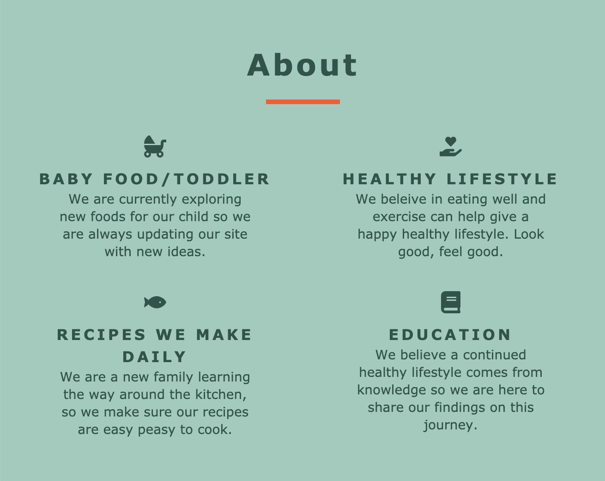
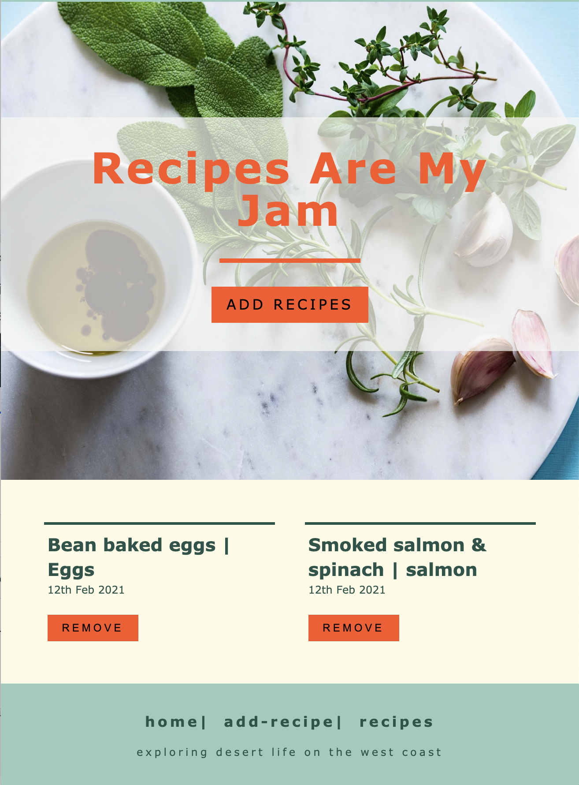
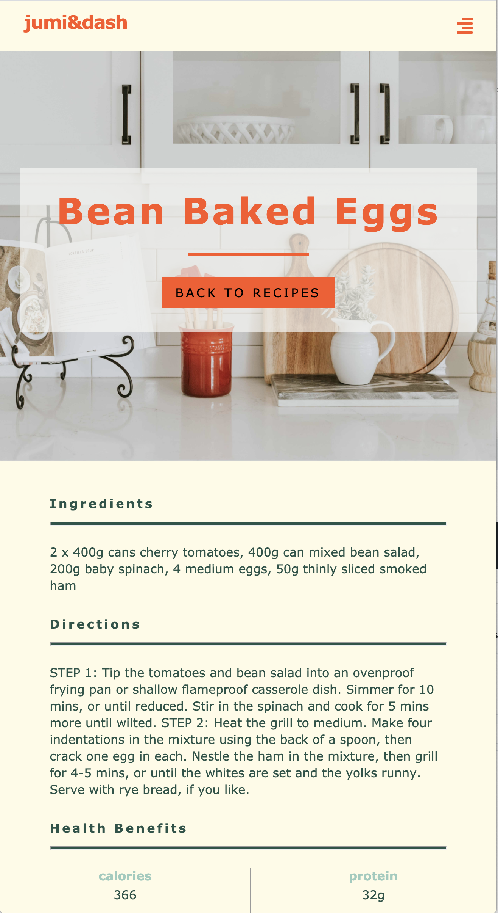
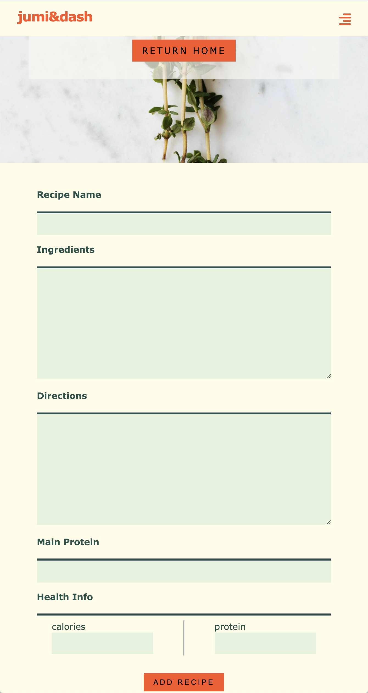

# jumi&dash

# live site
```jumianddash
https://www.jumianddash.com
```

# GitHub
```github
https://github.com/jpgraziani/jumi-client-heroku
```

# ScreenShots
home screen:


services:


recipes featured:


recipe:


add recipe:


# Summary
This App will help users see recipes in one location. Allow users to create new recipes and delete recipes that have been created. 

# Fullstack App Built With
* React.js
* CSS
* Node.js
* Express
* PostgreSQL

# API documentation

#### /recipes
- (/api/recipes)
- GET: Returns a list of all current recipes.
- POST: Create a new recipe to the database

#### /recipes/:id
- (/api/recipes/:id)
- GET: Return a single recipe
- DELETE: Remove a single recipe from the database wtih a valid recipe id
